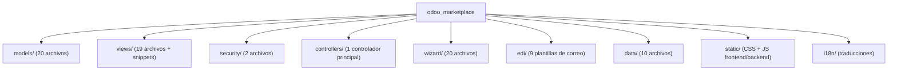
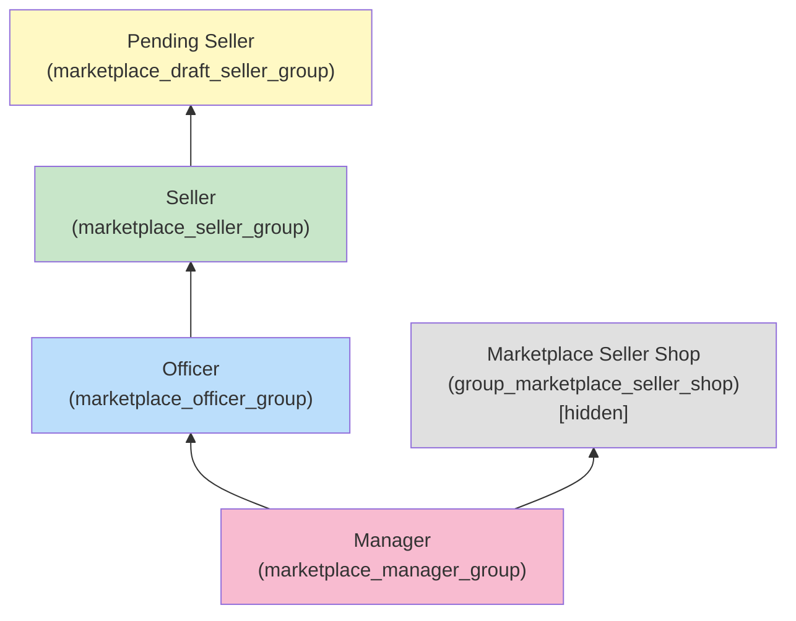
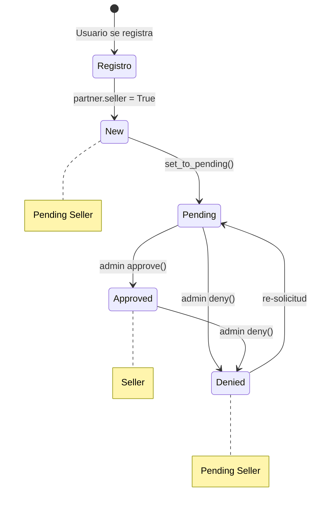
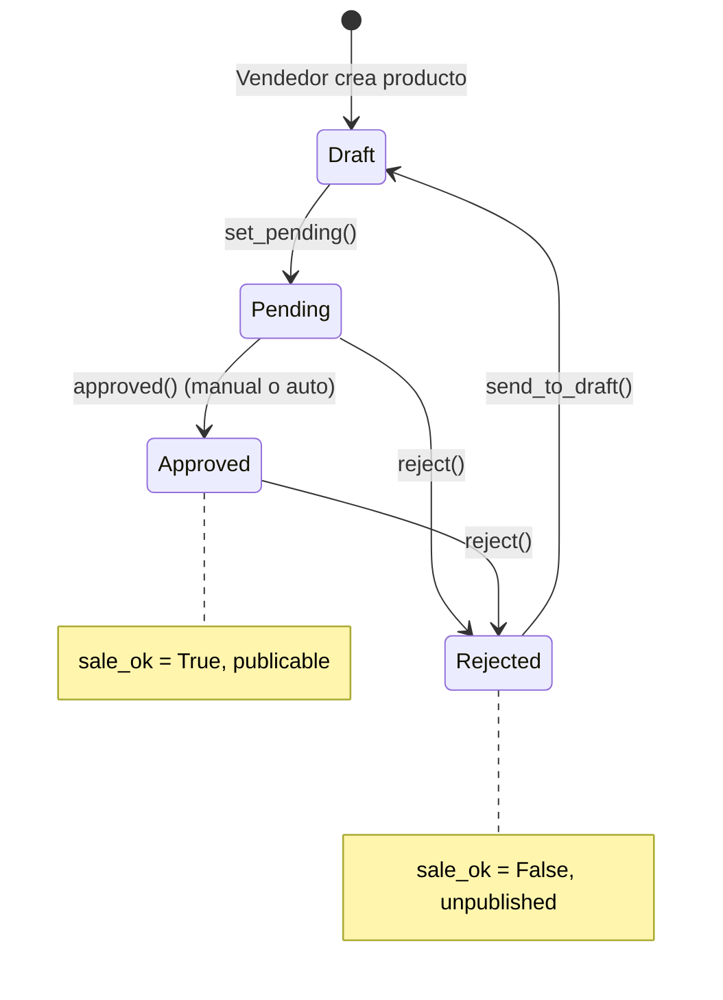
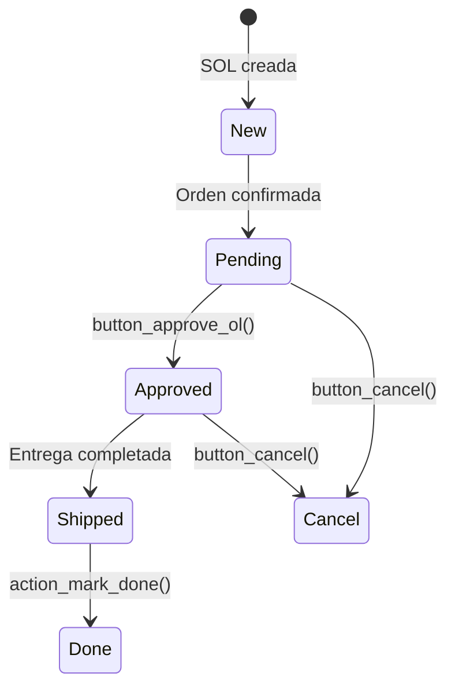
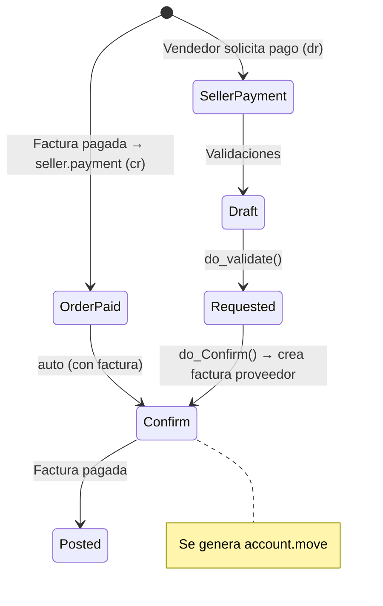
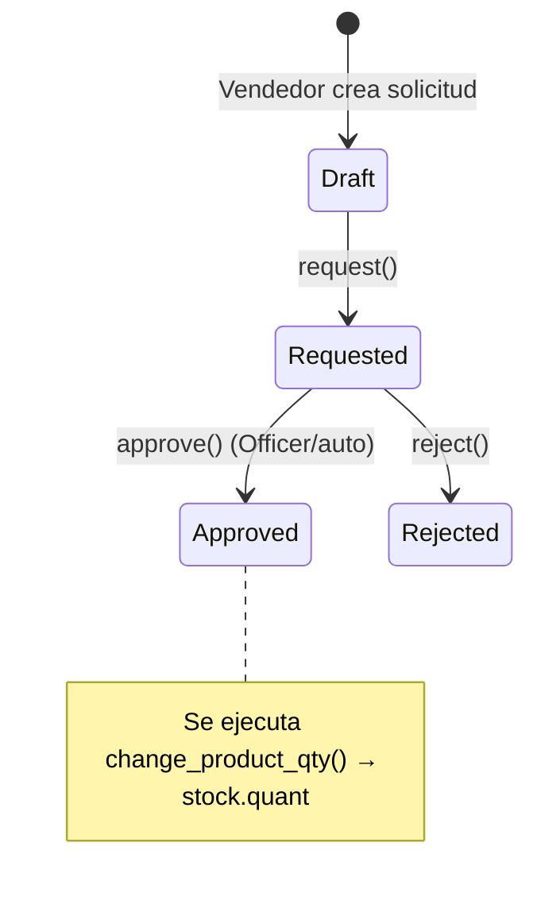

---
aliases:
  - Marketplace
tags:
  - project/idea
  - dev/erp
  - dev/sales
date: 2026-05-04
---
**Sources**: [Webkul Store](https://store.webkul.com/Odoo-Multi-Vendor-Marketplace.html)

**Related:** [[Odoo]]

---

## Main idea

``Odoo`` Multi Vendor Marketplace helps businesses build online marketplace where multiple sellers can register, manage products, and sell through one unified platform easily.

---

## Goal

Migrate the existing 17 version module to the most recent ``Odoo`` 19 version, while improving its functionalities and the business model around it.

---

## Objectives

* Migrate from ``Odoo`` 17 to ``Odoo`` 19
* Remove the "one seller, one store" rule
* Improve the module by using the most modern ``Odoo`` capabilities
* Extend the module functionalities

---

## ``Odoo`` 17 Module Details (Analysis)

> [!NOTE]
> Módulo comercial de **Webkul Software Pvt. Ltd.** — versión 2.1.3, precio $299 USD.
> Licencia propietaria. Diseñado para Odoo serie 17.0 (verificado en `pre_init_hook`).


### 1. Información General

| Campo | Valor |
|---|---|
| **Nombre técnico** | `odoo_marketplace` |
| **Nombre** | Odoo Multi Vendor Marketplace |
| **Categoría** | Website |
| **Dependencias** | `website_sale_stock`, `stock_account`, `delivery`, `sale_management` |
| **Aplicación** | ✅ Sí (`application: True`) |
| **Auto-install** | ❌ No |

### 2. Arquitectura General




### 3. Modelos

#### 3.1 Modelos Nuevos

| Modelo | Archivo | Descripción |
|---|---|---|
| `seller.payment` | [seller_payment.py](file:///c:/Users/USER/Documents/Coding/Odoos/odoo19/my_addons/odoo_marketplace/models/seller_payment.py) | Pagos del marketplace (crédito/débito). Estados: draft → requested → confirm → posted → canceled |
| `seller.payment.method` | [seller_payment_method.py](file:///c:/Users/USER/Documents/Coding/Odoos/odoo19/my_addons/odoo_marketplace/models/seller_payment_method.py) | Métodos de pago del vendedor (cheque, transferencia, etc.) |
| `marketplace.stock` | [stock.py](file:///c:/Users/USER/Documents/Coding/Odoos/odoo19/my_addons/odoo_marketplace/models/stock.py#L28-L206) | Solicitudes de inventario del vendedor. Estados: draft → requested → approved → rejected |
| `seller.shop` | [seller_shop.py](file:///c:/Users/USER/Documents/Coding/Odoos/odoo19/my_addons/odoo_marketplace/models/seller_shop.py) | Tienda del vendedor con URL, banner, logo, productos |
| `seller.shop.style` | [seller_shop.py](file:///c:/Users/USER/Documents/Coding/Odoos/odoo19/my_addons/odoo_marketplace/models/seller_shop.py#L26-L31) | Estilos CSS para tiendas |
| `seller.review` | [seller_review.py](file:///c:/Users/USER/Documents/Coding/Odoos/odoo19/my_addons/odoo_marketplace/models/seller_review.py#L29-L161) | Reseñas de vendedores (rating 1-5, publicable) |
| `review.help` | [seller_review.py](file:///c:/Users/USER/Documents/Coding/Odoos/odoo19/my_addons/odoo_marketplace/models/seller_review.py#L163-L181) | Votos útil/no útil en reseñas |
| `seller.recommendation` | [seller_review.py](file:///c:/Users/USER/Documents/Coding/Odoos/odoo19/my_addons/odoo_marketplace/models/seller_review.py#L183-L230) | Recomendaciones de vendedor (sí/no) |
| `marketplace.dashboard` | [marketplace_dashboard.py](file:///c:/Users/USER/Documents/Coding/Odoos/odoo19/my_addons/odoo_marketplace/models/marketplace_dashboard.py) | Dashboard con conteos: productos, vendedores, pedidos, pagos, stock |
| `seller.social.media.link` | — | Links de redes sociales del vendedor |
| `marketplace.social.media` | — | Redes sociales disponibles |

#### 3.2 Modelos Heredados (Extensiones)

| Modelo | Archivo | Campos/Funcionalidad Añadida |
|---|---|---|
| `res.partner` | [res_partner.py](file:///c:/Users/USER/Documents/Coding/Odoos/odoo19/my_addons/odoo_marketplace/models/res_partner.py) | **956 líneas**. Añade: `seller`, `state` (new/pending/approved/denied), `commission`, `warehouse_id`, `location_id`, `payment_method`, `seller_shop_id`, `seller_review_ids`, perfil web, URL handler |
| `res.users` | [res_users.py](file:///c:/Users/USER/Documents/Coding/Odoos/odoo19/my_addons/odoo_marketplace/models/res_users.py) | Métodos de verificación de grupo, signup como vendedor, gestión de grupos |
| `product.template` | [marketplace_product.py](file:///c:/Users/USER/Documents/Coding/Odoos/odoo19/my_addons/odoo_marketplace/models/marketplace_product.py#L23-L409) | `status` (draft/pending/approved/rejected), `marketplace_seller_id`, `mp_qty`, flujo de aprobación |
| `product.product` | [marketplace_product.py](file:///c:/Users/USER/Documents/Coding/Odoos/odoo19/my_addons/odoo_marketplace/models/marketplace_product.py#L411-L549) | `marketplace_status`, `mp_var_qty` para variantes |
| `sale.order` | [sale.py](file:///c:/Users/USER/Documents/Coding/Odoos/odoo19/my_addons/odoo_marketplace/models/sale.py#L22-L117) | `admin_commission`, `seller_amount`, warehouse override por vendedor |
| `sale.order.line` | [sale.py](file:///c:/Users/USER/Documents/Coding/Odoos/odoo19/my_addons/odoo_marketplace/models/sale.py#L119-L347) | `marketplace_seller_id`, `marketplace_state` (new→pending→approved→shipped→done→cancel), `seller_amount`, `admin_commission` |
| `stock.picking` | [stock.py](file:///c:/Users/USER/Documents/Coding/Odoos/odoo19/my_addons/odoo_marketplace/models/stock.py#L208-L306) | `marketplace_seller_id`, separación de pickings por vendedor |
| `stock.move` | [stock.py](file:///c:/Users/USER/Documents/Coding/Odoos/odoo19/my_addons/odoo_marketplace/models/stock.py#L308-L356) | Asignación de picking por vendedor, actualización de `marketplace_state` en SOL |
| `account.move` | [account_move.py](file:///c:/Users/USER/Documents/Coding/Odoos/odoo19/my_addons/odoo_marketplace/models/account_move.py) | Creación automática de `seller.payment` al facturar, cálculo de comisiones |
| `account.move.line` | [account_move.py](file:///c:/Users/USER/Documents/Coding/Odoos/odoo19/my_addons/odoo_marketplace/models/account_move.py#L160-L180) | `seller_commission` |
| `res.config.settings` | [res_config.py](file:///c:/Users/USER/Documents/Coding/Odoos/odoo19/my_addons/odoo_marketplace/models/res_config.py) | **340 líneas** de configuración global del marketplace |
| `website` | [website.py](file:///c:/Users/USER/Documents/Coding/Odoos/odoo19/my_addons/odoo_marketplace/models/website.py) | Campos `mp_*` para configuración de website (menús, reseñas, listas, etc.) |
| `ir.ui.menu` | [ir_ui_menu.py](file:///c:/Users/USER/Documents/Coding/Odoos/odoo19/my_addons/odoo_marketplace/models/ir_ui_menu.py) | Restricción de menús para vendedores |
| `ir.actions.act_window` | [ir_action.py](file:///c:/Users/USER/Documents/Coding/Odoos/odoo19/my_addons/odoo_marketplace/models/ir_action.py) | Restricción de acciones para vendedores |
| `ir.attachment` | [ir_attachment.py](file:///c:/Users/USER/Documents/Coding/Odoos/odoo19/my_addons/odoo_marketplace/models/ir_attachment.py) | Restricción de adjuntos para vendedores |


### 4. Seguridad

#### 4.1 Categoría de Módulo

```
ir.module.category: "Marketplace"
```

#### 4.2 Grupos de Acceso (Jerarquía)



| Grupo | XML ID | Hereda de | Usuarios por defecto |
|---|---|---|---|
| **Pending Seller** | `marketplace_draft_seller_group` | — | Usuarios que solicitan ser vendedor |
| **Seller** | `marketplace_seller_group` | Pending Seller | Vendedores aprobados |
| **Officer** | `marketplace_officer_group` | Seller | — |
| **Manager** | `marketplace_manager_group` | Officer + Seller Shop | `base.user_root`, `base.user_admin` |
| **Seller Shop** | `group_marketplace_seller_shop` | — (hidden) | Controlado por config |


#### 4.3 Derechos de Acceso (ir.model.access.csv) — Resumen

> [!IMPORTANT]
> El archivo tiene **~235 líneas** con permisos granulares para 4 niveles de grupo.

##### Pending Seller (Draft)
- **Solo lectura** en la mayoría de modelos (`sale.order.line`, `stock.warehouse`, `stock.location`, etc.)
- **Read+Write** en `res.partner` (su propio perfil)
- **Sin acceso** a `account.move` ni `sale.order`
- Acceso a wizards del marketplace

##### Seller
- **CRUD limitado**: Puede crear/editar `product.template`, `product.product`, `marketplace.stock`, `seller.shop`
- **Solo lectura**: `account.move`, `seller.payment`, `res.partner`
- **No puede eliminar**: `product.template`, `stock.picking`, `marketplace.stock`
- Acceso a variantes, atributos, pricelist items

##### Officer
- **CRUD completo** (sin eliminar) en la mayoría de modelos
- Puede crear y editar `account.move`, `seller.payment`, `res.partner`
- Reseñas y recomendaciones con CRUD

##### Manager
- **CRUD completo** (incluyendo eliminar) en **todos** los modelos del marketplace

##### Portal y Público
- `base.group_portal`: Read+Write+Create en `seller.review`, `review.help`, `seller.recommendation`
- `base.group_public`: Solo lectura en reviews, social media, styles


#### 4.4 Record Rules (Reglas de Registro)

> [!IMPORTANT]
> **~50 reglas de registro** definidas en [marketplace_security.xml](file:///c:/Users/USER/Documents/Coding/Odoos/odoo19/my_addons/odoo_marketplace/security/marketplace_security.xml), todas con `noupdate="1"`.


##### Reglas para Seller

| Modelo | Regla | Dominio |
|---|---|---|
| `sale.order.line` | Ver solo las propias | `[('marketplace_seller_id','=',user.partner_id.id), ('marketplace_state','!=','new')]` |
| `res.partner` | Ver solo sus clientes | `['|',('id','child_of',user.commercial_partner_id.id),('id','in',user.partner_id.seller_partner_ids.ids)]` |
| `product.template` | Solo sus productos | `[('marketplace_seller_id','=',user.partner_id.id)]` |
| `product.template` | + Ver publicados (solo lectura) | `[('website_published','=',True),('sale_ok','=',True)]` — solo `perm_read` |
| `product.product` | Solo sus variantes | `[('product_tmpl_id.marketplace_seller_id','=',user.partner_id.id)]` |
| `seller.payment` | Solo sus pagos | `[('seller_id','=',user.partner_id.id)]` |
| `marketplace.stock` | Solo su inventario | `[('product_id.marketplace_seller_id','=',user.partner_id.id)]` |
| `stock.move` | Solo sus movimientos | `[('product_id.product_tmpl_id.marketplace_seller_id','=',user.partner_id.id)]` |
| `stock.picking` | Solo sus entregas | `[('marketplace_seller_id.id','=',user.partner_id.id)]` |
| `seller.shop` | Solo su tienda | `[('seller_id.id','=',user.partner_id.id)]` |
| `sale.order` | Órdenes con sus productos (R+W, no create/delete) | `['|',('order_line.marketplace_seller_id.id','=',user.partner_id.id),...]` |
| `account.move.line` | Solo sus líneas de factura (solo lectura) | `['|',('product_id.marketplace_seller_id','=',user.partner_id.id),('move_id.partner_id','=',user.partner_id.id)]` |
| `marketplace.dashboard` | Dashboard sin estado 'seller' | `[('state','!=','seller')]` |


##### Reglas para Officer
- **Acceso total** `[(1,'=',1)]` en: `product.template`, `product.product`, `res.partner`, `marketplace.stock`, `stock.move`, `stock.picking`, `seller.shop`, `seller.payment`, `account.move.line`, `marketplace.dashboard`
- SOL: Solo las que tienen `marketplace_seller_id != False`

##### Reglas para Manager
- Duplican las del Officer con `[(1,'=',1)]` o `[]` — acceso completo a todo


### 5. Flujos de Negocio Principales

#### 5.1 Flujo del Vendedor




#### 5.2 Flujo del Producto




#### 5.3 Flujo de Pedidos (Sale Order Line)




#### 5.4 Flujo de Pagos al Vendedor




#### 5.5 Flujo de Inventario




### 6. Vistas

#### 6.1 Vistas Backend (19 archivos XML)

| Archivo | Contenido |
|---|---|
| [mp_menu_view.xml](file:///c:/Users/USER/Documents/Coding/Odoos/odoo19/my_addons/odoo_marketplace/views/mp_menu_view.xml) | Menú principal "Seller Dashboard" con submenús |
| [seller_view.xml](file:///c:/Users/USER/Documents/Coding/Odoos/odoo19/my_addons/odoo_marketplace/views/seller_view.xml) | Vistas form/tree/kanban para vendedores (`res.partner` filtrado) |
| [mp_product_view.xml](file:///c:/Users/USER/Documents/Coding/Odoos/odoo19/my_addons/odoo_marketplace/views/mp_product_view.xml) | Vistas de productos marketplace (44KB) |
| [mp_sol_view.xml](file:///c:/Users/USER/Documents/Coding/Odoos/odoo19/my_addons/odoo_marketplace/views/mp_sol_view.xml) | Líneas de pedido con estado marketplace |
| [mp_stock_view.xml](file:///c:/Users/USER/Documents/Coding/Odoos/odoo19/my_addons/odoo_marketplace/views/mp_stock_view.xml) | Inventario marketplace (55KB — picking, moves, stock) |
| [seller_payment_view.xml](file:///c:/Users/USER/Documents/Coding/Odoos/odoo19/my_addons/odoo_marketplace/views/seller_payment_view.xml) | Pagos al vendedor |
| [seller_shop_view.xml](file:///c:/Users/USER/Documents/Coding/Odoos/odoo19/my_addons/odoo_marketplace/views/seller_shop_view.xml) | Tiendas de vendedores |
| [seller_review_view.xml](file:///c:/Users/USER/Documents/Coding/Odoos/odoo19/my_addons/odoo_marketplace/views/seller_review_view.xml) | Reseñas y recomendaciones |
| [mp_dashboard_view.xml](file:///c:/Users/USER/Documents/Coding/Odoos/odoo19/my_addons/odoo_marketplace/views/mp_dashboard_view.xml) | Dashboard kanban (66KB) |
| [res_config_view.xml](file:///c:/Users/USER/Documents/Coding/Odoos/odoo19/my_addons/odoo_marketplace/views/res_config_view.xml) | Configuración (58KB) |
| [res_partner_view.xml](file:///c:/Users/USER/Documents/Coding/Odoos/odoo19/my_addons/odoo_marketplace/views/res_partner_view.xml) | Extensión del formulario de contacto |
| [account_invoice_view.xml](file:///c:/Users/USER/Documents/Coding/Odoos/odoo19/my_addons/odoo_marketplace/views/account_invoice_view.xml) | Facturas del vendedor |
| [website_config_view.xml](file:///c:/Users/USER/Documents/Coding/Odoos/odoo19/my_addons/odoo_marketplace/views/website_config_view.xml) | Config del website |
| [sequence_view.xml](file:///c:/Users/USER/Documents/Coding/Odoos/odoo19/my_addons/odoo_marketplace/views/sequence_view.xml) | Secuencias para pagos |


#### 6.2 Vistas Website (Frontend)

| Archivo | Contenido |
|---|---|
| [website_mp_template.xml](file:///c:/Users/USER/Documents/Coding/Odoos/odoo19/my_addons/odoo_marketplace/views/website_mp_template.xml) | Templates principales: landing page, lista de vendedores, signup |
| [website_seller_profile_template.xml](file:///c:/Users/USER/Documents/Coding/Odoos/odoo19/my_addons/odoo_marketplace/views/website_seller_profile_template.xml) | Perfil del vendedor (48KB, muy detallado) |
| [website_seller_shop_template.xml](file:///c:/Users/USER/Documents/Coding/Odoos/odoo19/my_addons/odoo_marketplace/views/website_seller_shop_template.xml) | Tienda del vendedor |
| [website_mp_product_template.xml](file:///c:/Users/USER/Documents/Coding/Odoos/odoo19/my_addons/odoo_marketplace/views/website_mp_product_template.xml) | Producto en website con info del vendedor |
| [website_account_template.xml](file:///c:/Users/USER/Documents/Coding/Odoos/odoo19/my_addons/odoo_marketplace/views/website_account_template.xml) | Cuenta del vendedor ("Become a Seller") |
| [snippets/sell_snippets.xml](file:///c:/Users/USER/Documents/Coding/Odoos/odoo19/my_addons/odoo_marketplace/views/snippets/sell_snippets.xml) | Snippets para website |


#### 6.3 Estructura de Menús Backend

```
📁 Seller Dashboard (wk_seller_dashboard) — grupo: marketplace_draft_seller_group
├── 📂 Sellers
│   ├── Sellers
│   ├── Seller Shops (Officer+)
│   ├── Seller Reviews (Officer+)
│   └── Seller Recommendations (Officer+)
├── 📂 Sales (Seller+)
│   ├── Orders
│   ├── Pay To Seller (Manager+)
│   ├── Request For Payment (Seller+)
│   ├── Seller Payments
│   └── Order Analysis
├── 📂 Products (Seller+)
│   ├── Products
│   └── Product Variants
├── 📂 Invoicing (Seller+)
│   ├── Seller Bills (Officer+)
│   └── Payments
├── 📂 Inventory (Seller+)
│   ├── Inventory Requests
│   ├── Delivery Orders
│   └── Stock Moves
└── 📂 Configuration (Seller+)
    ├── Settings (Manager+)
    ├── Website Categories
    ├── Seller Payment Methods (Officer+)
    └── Social Media (Officer+)
```

---

## 7. Controladores (Rutas Web)

Archivo principal: [main.py](file:///c:/Users/USER/Documents/Coding/Odoos/odoo19/my_addons/odoo_marketplace/controllers/main.py) — **1035 líneas, 4 clases**.

| Clase | Rutas principales | Función |
|---|---|---|
| `AuthSignupHome` | `/web/login`, `/seller/signup` | Login con redirección a dashboard, registro como vendedor |
| `website_marketplace_dashboard` | `/my/marketplace/become_seller`, `/my/marketplace/seller`, `/my/marketplace` | Convertirse en vendedor, panel del vendedor |
| `MarketplaceSellerProfile` | `/seller/profile/<id>`, `/sellers/list/` | Perfil público del vendedor, lista de vendedores |
| `MarketplaceSellerShop` | `/seller/shop/<handler>`, `/seller/shops/list/`, `/seller` | Tienda del vendedor, lista de tiendas, landing page |
| `SellerReview` | `/seller/review` (JSON) | Crear reseñas, votar helpful/not helpful |

---

## 8. Wizards

| Wizard | Archivo | Función |
|---|---|---|
| `server.action.wizard` | [action_wizard.py](file:///c:/Users/USER/Documents/Coding/Odoos/odoo19/my_addons/odoo_marketplace/wizard/action_wizard.py) | Aprobar/rechazar productos en masa |
| `seller.payment.wizard` | [seller_payment_wizard.py](file:///c:/Users/USER/Documents/Coding/Odoos/odoo19/my_addons/odoo_marketplace/wizard/seller_payment_wizard.py) | Solicitar pago al admin / Pagar al vendedor |
| `seller.resistration.wizard` | [seller_registration_wizard.py](file:///c:/Users/USER/Documents/Coding/Odoos/odoo19/my_addons/odoo_marketplace/wizard/seller_registration_wizard.py) | Registro de vendedor desde backend |
| `seller.status.reason.wizard` | [seller_status_reason.py](file:///c:/Users/USER/Documents/Coding/Odoos/odoo19/my_addons/odoo_marketplace/wizard/seller_status_reason.py) | Motivo de cambio de estado del vendedor |
| `variant.approval.wizard` | [variant_approval_wizard.py](file:///c:/Users/USER/Documents/Coding/Odoos/odoo19/my_addons/odoo_marketplace/wizard/variant_approval_wizard.py) | Aprobación de variantes de producto |
| `mp.wizard.message` | — | Mensajes del marketplace |
| Bulk/Mass action wizards | — | Acciones masivas sobre SOL (aprobar, confirmar, marcar como hecho) |
| Publish/Unpublish wizards | [publish.py](file:///c:/Users/USER/Documents/Coding/Odoos/odoo19/my_addons/odoo_marketplace/wizard/publish.py), [unpublish.py](file:///c:/Users/USER/Documents/Coding/Odoos/odoo19/my_addons/odoo_marketplace/wizard/unpublish.py) | Publicar/despublicar productos en masa |
| `account.payment.register` | [account_payment_register.py](file:///c:/Users/USER/Documents/Coding/Odoos/odoo19/my_addons/odoo_marketplace/wizard/account_payment_register.py) | Registro de pago con integración marketplace |

---

## 9. Plantillas de Correo (EDI)

| Template | Destinatario | Evento |
|---|---|---|
| `send_mail_to_seller` | Vendedor | Contacto desde website |
| `product_status_change_mail_to_admin` | Admin | Producto solicita aprobación |
| `product_status_change_mail_to_seller` | Vendedor | Producto aprobado/rechazado |
| `seller_creation_mail_to_admin` | Admin | Nuevo vendedor registrado |
| `seller_creation_mail_to_seller` | Vendedor | Confirmación de registro |
| `seller_status_change_mail_to_admin` | Admin | Vendedor aprobado/rechazado |
| `seller_status_change_mail_to_seller` | Vendedor | Notificación de aprobación/rechazo |
| `order_mail_to_seller` | Vendedor | Nuevo pedido confirmado |
| `send_mail_to_admin` | Admin | Diversas notificaciones |

---

## 10. Configuración del Módulo (`res.config.settings`)

### Configuraciones Globales

| Categoría | Campos |
|---|---|
| **Productos** | Auto aprobación, categoría interna |
| **Inventario** | Ubicación/almacén por defecto, auto aprobación de cantidades |
| **Vendedores** | Auto aprobación, comisión global (%) |
| **Pagos** | Límite de pago, gap mínimo entre solicitudes, journal, moneda, producto de pago |
| **Notificaciones** | 8 toggles + 8 templates de correo configurables |
| **Website** | Mostrar/ocultar: lista de vendedores, tiendas, botón "become seller", menú sell, conteos, reseñas, políticas |
| **Grupos** | Habilitar/deshabilitar variantes, tiendas, pricelists y UoM para vendedores |

### Configuraciones por Vendedor
- Override de parámetros globales via `set_seller_wise_settings` en `res.partner`
- Cada vendedor puede tener su propia: comisión, warehouse, location, auto-approve

---

## 11. Assets (Frontend/Backend)

### Backend (`web.assets_backend`)
- `mp_dashboard.css` — Estilos del dashboard
- `url_handler.js`, `clickable_off.js`, `right_click_prevent.js` — Restricciones UI
- `icon_restriction.xml` — Template de restricción de iconos

### Frontend (`web.assets_frontend`)
- `marketplace.css`, `marketplace_snippet.css` — Estilos marketplace
- `star-rating.css`, `review_chatter.scss` — Estilos de reseñas
- `marketplace.js` — Lógica principal frontend
- `review_chatter.js`, `star-rating.js`, `seller_ratting.js` — Rating/reseñas
- `jquery.timeago.js`, `jquery.circlechart.js` — Librerías auxiliares
- `marketplace_snippets.js` — Snippets

---

## 12. Datos de Demostración

| Archivo | Contenido |
|---|---|
| `mp_product_demo_data.xml` | Categoría demo para productos |
| `mp_config_setting_data.xml` | Configuración inicial (templates de correo predefinidos) |
| `seller_payment_method_data.xml` | 5 métodos de pago: PayPal, Cheque, COD, Paytm, Bank Transfer |
| `marketplace_dashboard_demo.xml` | Items del dashboard (Product, Seller, Order, Payment, Stock) |
| `seller_shop_style_data.xml` | Estilos CSS para tiendas |
| `social_media_data.xml` | Redes sociales predefinidas |
| `website_menus_data.xml` | Menús del website |

---

## 13. Observaciones Técnicas

> [!WARNING]
> **Compatibilidad con Odoo 19**: Este módulo está diseñado para Odoo 17. El `pre_init_hook` valida `16.0 < server_serie <= 17.0`, por lo que **fallará la instalación en Odoo 19** sin modificar esa validación.

> [!CAUTION]
> - Usa `_read_group_fill_results` que es un método interno de Odoo y puede cambiar entre versiones
> - Extensivo uso de `sudo()` en controladores para acceso público
> - Las record rules usan `noupdate="1"`, lo que significa que no se actualizan al actualizar el módulo
> - `write()` en `res.partner` hace `pop()` de campos protegidos sin raise, lo cual es silencioso

> [!TIP]
> Para migrar a Odoo 19, los puntos clave serían:
> 1. Cambiar la validación de versión en `pre_init_hook`
> 2. Verificar compatibilidad de `_read_group_fill_results`
> 3. Verificar cambios en la API de `website_sale` y `stock`
> 4. Revisar deprecaciones en `ir.default` y `mail.template`

---

## Claude Sessions
