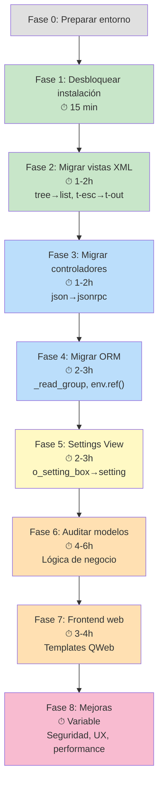

---
aliases:
  - Marketplace
tags:
  - dev/erp
  - dev/backend
date: 2026-05-04
---
**Related:** [[Marketplace]]

---

# Plan de Migración: `odoo_marketplace` — Odoo 17 → Odoo 19

## Filosofía del Plan

Este plan **NO** es una lista de "buscar y reemplazar". Está diseñado para que **tú migres pieza por pieza**, comprendiendo qué hace cada parte del módulo conforme la tocas. Las fases van **de lo mecánico a lo arquitectónico** por tres razones:

1. **Feedback loop rápido**: Las primeras fases (renombrar tags, cambiar rutas) te dan resultados inmediatos — el módulo se instala, las vistas se renderizan. Eso te motiva y te da una base funcional para testear lo siguiente.

2. **Complejidad creciente**: Empiezas con patrones sintácticos (XML tags, route types) que solo requieren entender *qué* cambió. Luego pasas a patrones semánticos (ORM, controladores) donde necesitas entender *por qué* cambió. Y finalmente llegas a la lógica de negocio donde puedes decidir *qué mejorar*.

3. **Cada fase es un módulo instalable**: Después de completar cada fase, deberías poder instalar/actualizar el módulo sin errores en esa capa. Esto te permite avanzar de forma incremental y hacer commits separados.

---

## Inventario de Breaking Changes Detectados

Antes de planear, esto es lo que encontré que necesita cambiar:

| Cambio | Impacto | Cantidad | Archivos |
|---|---|---|---|
| `pre_init_check` bloquea Odoo 19 | 🔴 Bloqueante | 1 | `__init__.py` |
| `<tree>` → `<list>` | 🟡 Vistas no renderizan | ~35 instancias | 14 archivos XML (views/ + wizard/) |
| `type='json'` → `type='jsonrpc'` | 🔴 Rutas no responden | 21 rutas | `controllers/main.py` |
| `_read_group_fill_results` eliminado | 🔴 Error Python | 8 overrides | 6 archivos `.py` |
| `check_object_reference` → `_xmlid_lookup` o `self.env.ref()` | 🔴 Error Python | 17 usos | 7 archivos `.py` |
| `t-esc` → `t-out` (QWeb) | 🟡 Deprecado (warnings) | ~20+ | 5 archivos XML |
| `o_setting_box` / `o_settings_container` → `<setting>` / `<block>` | 🟡 Settings pudrían no renderizar bien | ~45 instancias | `res_config_view.xml` |
| `stock.valuation.layer` eliminado en Odoo 19 | 🟢 No usado directamente | 0 | — |
| `name_get()` deprecado | 🟢 Solo comentarios | 0 overrides reales | — |

---

## Fase 0: Preparación (antes de tocar código)

**Objetivo**: Tener un entorno seguro para trabajar.

### Pasos
1. **Crear una rama git** para la migración:
   ```
   git checkout -b migration/odoo19-marketplace
   ```
2. **Copiar el módulo original** a un respaldo (o asegurarte de tener el commit original)
3. **Tener una base de datos de Odoo 19 limpia** para pruebas (sin datos de producción)
4. **Verificar que Odoo 19 levanta** sin el módulo marketplace

### Por qué empezar aquí
Sin esto, cualquier error te deja sin referencia. Git te permite hacer commits por fase y revertir si algo sale mal. Una BD limpia te permite identificar errores del módulo vs errores de datos.

---

## Fase 1: Desbloquear la instalación

**Objetivo**: Que el módulo se pueda instalar en Odoo 19 (aunque falle después).

**Tiempo estimado**: 15 minutos

**Qué aprenderás**: Cómo Odoo maneja la validación de versiones y el ciclo de vida de instalación de módulos.

### Archivos a modificar

#### [__init__.py](file:///c:/Users/USER/Documents/Coding/Odoos/odoo19/my_addons/odoo_marketplace/__init__.py)
```diff
-    if not 16.0 < float(server_serie) <= 17.0:
-        raise UserError(f'Module support Odoo series 17.0 but found {server_serie}.')
+    if not 18.0 < float(server_serie) <= 19.0:
+        raise UserError(f'Module support Odoo series 19.0 but found {server_serie}.')
```

#### [__manifest__.py](file:///c:/Users/USER/Documents/Coding/Odoos/odoo19/my_addons/odoo_marketplace/__manifest__.py)
- Cambiar la versión del módulo (ej: `"version": "19.0.1.0.0"`)

### Verificación
```bash
# Intentar instalar — fallará con otros errores, pero NO con el error de versión
python odoo-bin -d test_db -i odoo_marketplace --stop-after-init
```

### Por qué es la primera fase
Es un **gate keeper** literal. Sin esto, ni siquiera puedes intentar instalar. Y es un cambio trivial que te da confianza.

---

## Fase 2: Migración de vistas XML (sintaxis)

**Objetivo**: Que todas las vistas pasen la validación XML de Odoo 19.

**Tiempo estimado**: 1-2 horas

**Qué aprenderás**: La estructura de vistas de Odoo (tree/list, form, kanban), cómo heredar vistas, y el sistema de renderizado XML.

### 2.1 — `<tree>` → `<list>` (~35 cambios)

En Odoo 18+, el tag `<tree>` fue renombrado a `<list>`. Es un cambio mecánico pero toca **14 archivos**.

**Archivos a modificar** (en `views/`):
- `seller_view.xml` (3 instancias)
- `seller_shop_view.xml` (1)
- `seller_review_view.xml` (5)
- `seller_payment_view.xml` (3)
- `res_config_view.xml` (1)
- `mp_stock_view.xml` (4)
- `mp_sol_view.xml` (1)
- `mp_product_view.xml` (6)
- `account_invoice_view.xml` (1)

**Archivos en `wizard/`:**
- `variant_approval_wizard_view.xml` (1)
- `unpublish.xml` (1)
- `server_action_wizard.xml` (4)
- `publish.xml` (1)
- `mark_done_stats.xml` (1)
- `mark_approved.xml` (1)

**Ejemplo**:
```diff
-<tree string="Sellers" decoration-success="status=='approved'">
+<list string="Sellers" decoration-success="status=='approved'">
     <field name="name"/>
     ...
-</tree>
+</list>
```

> [!TIP]
> **Consejo práctico**: Usa buscar y reemplazar con regex en tu editor, pero **revisa cada uno visualmente**. Hay `<tree>` dentro de `<form>` (como One2many editables) que también deben cambiar. Ten cuidado de no tocar los `</tree>` de forma desparejada.

### 2.2 — `t-esc` → `t-out` (templates QWeb)

Archivos afectados:
- `views/mp_product_view.xml`
- `views/mp_dashboard_view.xml`
- `static/src/xml/icon_restriction.xml`
- `edi/send_mail_to_seller.xml`
- `edi/send_mail_to_admin.xml`

```diff
-<span t-esc="seller.name"/>
+<span t-out="seller.name"/>
```

> [!NOTE]
> `t-esc` todavía funciona en Odoo 19 (backward compatible), pero genera warnings y será removido en futuras versiones. Cambiarlo ahora es buena práctica.

### Verificación
```bash
# El módulo debería instalarse sin errores XML
python odoo-bin -d test_db -i odoo_marketplace --stop-after-init 2>&1 | grep -i "error\|warning"
```

### Por qué es la Fase 2
Son cambios **mecánicos y visuales** — si algo falla, lo ves inmediatamente (la vista no se renderiza). Te familiarizas con la estructura de *todos* los archivos XML del módulo sin tener que entender la lógica de negocio.

---

## Fase 3: Migración de controladores (rutas JSON)

**Objetivo**: Que todas las rutas web del marketplace funcionen.

**Tiempo estimado**: 1-2 horas

**Qué aprenderás**: El sistema de routing de Odoo, la diferencia entre rutas HTTP y JSONRPC, y cómo funciona el frontend del marketplace.

### Cambio requerido
En Odoo 19, `type='json'` → `type='jsonrpc'`.

**Archivo**: [controllers/main.py](file:///c:/Users/USER/Documents/Coding/Odoos/odoo19/my_addons/odoo_marketplace/controllers/main.py) — **21 rutas** afectadas.

**Listado completo de rutas a migrar**:

| Línea | Ruta | Función |
|---|---|---|
| 104 | `/mp/terms/and/conditions` | Términos y condiciones |
| 178 | `/profile/url/handler/vaidation` | Validación URL del perfil |
| 292 | `/seller/profile/recently-product/` | Productos recientes del perfil |
| 446 | `/seller/change_sequence` | Cambio de secuencia de productos |
| 458 | `/seller/change_size` | Cambio de tamaño de grid |
| 463 | `/seller/change_styles` | Cambio de estilos |
| 581 | `/seller/shop/change_sequence` | Secuencia en tienda |
| 593 | `/seller/shop/change_size` | Tamaño en tienda |
| 598 | `/seller/shop/recently-product/` | Productos recientes de tienda |
| 705 | `/add/header/button` | Botón en header |
| 787 | `/seller/review` | Crear reseña |
| 805 | `/seller/shop/change_styles` | Estilos de tienda |
| 826 | `/seller/review/help` | Votar utilidad de reseña |
| 861 | `/seller/load/review` | Cargar más reseñas |
| 872 | `/seller/load/review/count` | Conteo de reseñas |
| 898 | `/seller/recommend` | Recomendar vendedor |
| 922 | `/seller/review/check` | Verificar si ya revisó |
| 945 | `/track/sol` | Tracking de SOL |
| 957 | `/marketplace_mail/post/json` | Enviar mail |
| 968 | `/wk/check/mp/seller` | Verificar si es vendedor |
| 1022 | `/web/action/load` | Cargar acción |

```diff
-    @http.route(['/seller/review'], type='json', auth="public", website=True)
+    @http.route(['/seller/review'], type='jsonrpc', auth="public", website=True)
```

> [!IMPORTANT]
> La ruta `/web/action/load` (línea 1022) es **crítica** — override de una ruta core de Odoo. Verifica que el core de Odoo 19 aún expone esa ruta y con la misma firma. Si cambió, este override podría causar problemas graves.

### Verificación
- Navegar al website y verificar que las interacciones AJAX funcionan (reseñas, cambio de grid, etc.)
- Revisar la consola del navegador por errores 405/404 en las rutas JSON

### Por qué es la Fase 3
Después de las vistas, los controladores son el siguiente "punto de contacto" del módulo con el usuario. Además, cada ruta que lees te enseña una funcionalidad del frontend, ampliando tu comprensión del módulo.

---

## Fase 4: Migración del ORM (métodos eliminados/deprecados)

**Objetivo**: Eliminar todos los errores Python al levantar el módulo.

**Tiempo estimado**: 2-3 horas

**Qué aprenderás**: El ORM de Odoo en profundidad — `read_group`, sistema de referencia XML, y cómo Odoo maneja los agrupamientos en vistas kanban/list.

### 4.1 — `_read_group_fill_results` (8 overrides en 6 archivos)

Este método interno ya no existe en Odoo 18+. Se usaba para personalizar cómo se muestran los grupos "vacíos" en vistas agrupadas (kanban).

**Archivos afectados**:

| Archivo | Modelo | Líneas |
|---|---|---|
| [stock.py](file:///c:/Users/USER/Documents/Coding/Odoos/odoo19/my_addons/odoo_marketplace/models/stock.py) | `marketplace.stock` | 105-115 |
| [stock.py](file:///c:/Users/USER/Documents/Coding/Odoos/odoo19/my_addons/odoo_marketplace/models/stock.py) | `stock.picking` | 214-224 |
| [seller_review.py](file:///c:/Users/USER/Documents/Coding/Odoos/odoo19/my_addons/odoo_marketplace/models/seller_review.py) | `seller.review` | 140-150 |
| [seller_review.py](file:///c:/Users/USER/Documents/Coding/Odoos/odoo19/my_addons/odoo_marketplace/models/seller_review.py) | `seller.recommendation` | 205-215 |
| [seller_payment.py](file:///c:/Users/USER/Documents/Coding/Odoos/odoo19/my_addons/odoo_marketplace/models/seller_payment.py) | `seller.payment` | 92-102 |
| [sale.py](file:///c:/Users/USER/Documents/Coding/Odoos/odoo19/my_addons/odoo_marketplace/models/sale.py) | `sale.order.line` | 209-223 |
| [res_partner.py](file:///c:/Users/USER/Documents/Coding/Odoos/odoo19/my_addons/odoo_marketplace/models/res_partner.py) | `res.partner` | 238-252 |
| [marketplace_product.py](file:///c:/Users/USER/Documents/Coding/Odoos/odoo19/my_addons/odoo_marketplace/models/marketplace_product.py) | `product.template` | 80-95 |

**Estrategia de migración**: En Odoo 19, para mostrar todos los valores de un campo Selection en una vista agrupada (incluyendo los que no tienen registros), se usa el atributo `group_expand` en la definición del campo Selection:

```python
# Odoo 17 (ANTES) — override del método interno
def _read_group_fill_results(self, domain, groupby, remaining_groupbys,
                              aggregated_fields, count_field, read_group_result,
                              read_group_order=None):
    if groupby == 'state':
        # ... lógica para mostrar estados vacíos
    return super()._read_group_fill_results(...)

# Odoo 19 (DESPUÉS) — atributo en el campo
state = fields.Selection([...], group_expand=True)
# O si necesitas lógica personalizada:
state = fields.Selection([...], group_expand='_group_expand_states')

def _group_expand_states(self, states, domain):
    return [key for key, val in type(self).state.selection]
```

> [!IMPORTANT]
> **Lee cada override** antes de eliminarlo. Algunos pueden tener lógica adicional (filtros, reordenamiento) que deberás preservar de otra forma.

### 4.2 — `check_object_reference` → `self.env.ref()` (17 usos)

`ir.model.data.check_object_reference()` es un método legacy. El reemplazo moderno es `self.env.ref()`.

**Archivos afectados** (7):
- `controllers/main.py` (3 usos)
- `models/res_partner.py` (4 usos)
- `models/res_users.py` (1 uso)
- `models/marketplace_dashboard.py` (2 usos)
- `models/stock.py` (2 usos)
- `models/ir_ui_menu.py` (2 usos)
- `wizard/seller_registration_wizard.py` (1 uso)
- `wizard/seller_payment_wizard.py` (1 uso)

```python
# ANTES
draft_seller_group_id = self.env['ir.model.data'].check_object_reference(
    'odoo_marketplace', 'marketplace_draft_seller_group')[1]
groups_obj = self.env["res.groups"].browse(draft_seller_group_id)

# DESPUÉS
groups_obj = self.env.ref('odoo_marketplace.marketplace_draft_seller_group')
```

> [!TIP]
> `self.env.ref()` retorna el **recordset directamente** (no solo el ID). Eso simplifica mucho el código — ya no necesitas el `browse()` posterior.

### Verificación
```bash
python odoo-bin -d test_db -i odoo_marketplace --stop-after-init
# Debe instalar sin ningún error Python
```

### Por qué es la Fase 4
Estos son errores que crashean Python — te obligan a entender **qué hace cada método** que estás modificando. Especialmente `_read_group_fill_results` te enseña cómo funciona el sistema de agrupamiento de vistas, y `check_object_reference` te enseña el sistema de XML IDs de Odoo.

---

## Fase 5: Migración de la vista de Settings

**Objetivo**: Que la configuración del marketplace funcione correctamente en el panel de Settings de Odoo 19.

**Tiempo estimado**: 2-3 horas

**Qué aprenderás**: El sistema de configuración de Odoo, settings views, `res.config.settings`, y cómo funcionan los `ir.default`.

### Estado actual
El archivo [res_config_view.xml](file:///c:/Users/USER/Documents/Coding/Odoos/odoo19/my_addons/odoo_marketplace/views/res_config_view.xml) (682 líneas) ya usa parcialmente la estructura `<app>` y `<block>`, pero internamente sigue usando `o_setting_box`, `o_settings_container`, etc.

### Estrategia
La vista de settings es el archivo XML **más grande y complejo** del módulo. Yo te sugiero un enfoque de **reescritura progresiva**:

1. **Primero**: Intenta instalar tal cual. Si renderiza (aunque feo), déjalo como "funcional" y pasa a la siguiente fase. Puedes volver aquí después.
2. **Después**: Reescribe cada `<block>` usando la nueva estructura `<setting>`:

```xml
<!-- ANTES (Odoo 17) -->
<div class="col-12 col-lg-6 o_setting_box" title="...">
    <div class="o_setting_left_pane">
        <field name="auto_approve_seller"/>
    </div>
    <div class="o_setting_right_pane">
        <label for="auto_approve_seller" string="Seller Approval"/>
        <div class="text-muted">
            Si está habilitado, todas las solicitudes de vendedor se aprueban automáticamente.
        </div>
    </div>
</div>

<!-- DESPUÉS (Odoo 19) -->
<setting string="Seller Approval" help="Si está habilitado, todas las solicitudes de vendedor se aprueban automáticamente.">
    <field name="auto_approve_seller"/>
</setting>
```

> [!WARNING]
> La vista de settings tiene **un notebook con 4 tabs** (Product Terms, Payment Terms, Mail & Notifications, Website). Migra tab por tab, verificando después de cada uno.

### Por qué es la Fase 5
La vista de settings es la primera que verá un administrador. Es compleja pero ya parcialmente migrada. Te obliga a entender **cada configuración** del marketplace, lo cual te da contexto para las fases siguientes.

---

## Fase 6: Auditoría y migración de modelos

**Objetivo**: Verificar que la lógica de negocio de los modelos es compatible con Odoo 19.

**Tiempo estimado**: 4-6 horas (la fase más larga)

**Qué aprenderás**: La lógica de negocio completa del marketplace — flujos de vendedor, productos, pedidos, pagos e inventario.

### 6.1 — Modelo por modelo (orden sugerido)

El orden sigue las **dependencias de datos**: primero los modelos base, luego los que dependen de ellos.

#### A) `res_partner.py` (956 líneas) — ⚡ El más importante

**Qué verificar**:
- Campos heredados que puedan haber cambiado en Odoo 19
- Uso de `sudo()` en los métodos de aprobación
- `write()` que hace `pop()` silencioso de campos protegidos
- Métodos de notificación por email

**Mejora sugerida**: El `write()` actual suprime silenciosamente campos como `seller_payment_limit` cuando el usuario no es officer. Considera lanzar un `UserError` explícito en lugar de fallar silenciosamente.

#### B) `marketplace_product.py` (549 líneas)

**Qué verificar**:
- Herencia de `product.template` — verificar que los campos `sale_ok`, `website_published` sigan existiendo con la misma API en Odoo 19
- Método `toggle_website_published` — verificar firma en Odoo 19

#### C) `sale.py` (347 líneas)

**Qué verificar**:
- `_create_delivery_line()` override — verificar si este método sigue existiendo en Odoo 19
- `_prepare_invoice_line()` — verificar firma en Odoo 19

#### D) `stock.py` (364 líneas)

**Qué verificar**:
- `stock.valuation.layer` ya no existe en Odoo 19 (valoración se mueve a `stock.move`). Verifica que el módulo no dependa de él indirectamente.
- `stock.picking` — verificar campos como `backorder_id`, `show_check_availability`

#### E) `seller_payment.py` (374 líneas)

**Qué verificar**:
- Creación de `account.move` — la API de facturas ha evolucionado entre versiones
- `currency._convert()` — verificar la firma actual (Odoo ha cambiado parámetros entre versiones)

#### F) `account_move.py` (186 líneas)

**Qué verificar**:
- `get_view()` override usando `etree` — verificar que la firma sigue siendo compatible
- `action_post()` — verificar el flujo de estados de factura en Odoo 19

#### G) Modelos simples: `seller_shop.py`, `seller_review.py`, `marketplace_dashboard.py`, `website.py`, `res_config.py`

Estos son más autocontenidos y con menor riesgo de breaking changes.

### 6.2 — Verificar herencias de modelos core

```bash
# Verifica que ningún campo heredado haya sido removido
python odoo-bin -d test_db -i odoo_marketplace --stop-after-init --log-level=warning
```

### Por qué es la Fase 6
Necesitas las fases anteriores resueltas para poder probar la lógica de negocio. Esta fase te da el entendimiento más profundo del módulo — leerás cada modelo de principio a fin.

---

## Fase 7: Migración de plantillas web (frontend)

**Objetivo**: Que el sitio web del marketplace funcione visualmente.

**Tiempo estimado**: 3-4 horas

**Qué aprenderás**: QWeb templates, herencia de templates web, y la integración website_sale.

### Archivos a revisar
1. `website_mp_template.xml` — Landing page, lista de vendedores, signup
2. `website_seller_profile_template.xml` (48KB) — Perfil del vendedor
3. `website_seller_shop_template.xml` — Tienda del vendedor
4. `website_mp_product_template.xml` — Producto en website
5. `website_account_template.xml` — "Become a Seller"

### Qué verificar
- Templates heredados del core (`website_sale.products`, `website.layout`, etc.) que puedan haber cambiado de nombre o estructura en Odoo 19
- XPath expressions que apunten a nodos que ya no existan
- Assets CSS/JS que dependan de clases o widgets del frontend de Odoo 17

> [!WARNING]
> El frontend de Odoo es el área con **más cambios** entre versiones. Es probable que necesites reescribir algunos XPath o adaptar templates.

### Estrategia
1. Instala el módulo
2. Navega a `/seller` — si da error 500, revisa el log para identificar qué template falla
3. Corrige template por template
4. Prueba cada página: `/sellers/list`, `/seller/profile/<id>`, `/seller/shop/<handler>`

### Por qué es la Fase 7
El frontend depende de que los modelos (Fase 6), los controladores (Fase 3) y las rutas JSONRPC estén funcionando. Es la última pieza del puzzle funcional.

---

## Fase 8: Mejoras opcionales (post-migración)

**Objetivo**: Mejorar el módulo aprovechando las nuevas capacidades de Odoo 19.

**Tiempo estimado**: Variable (puedes hacer las que quieras)

### 8.1 — Mejoras de seguridad
- **Auditar usos de `sudo()`** en controladores — hay accesos públicos que crean registros con `sudo()`. Evalúa si puedes usar `with_user()` o restringir mejor.
- **Revisar record rules** — La regla de `sale.order` usa `order_line.marketplace_seller_id`, que puede ser lenta en tablas grandes.

### 8.2 — Mejoras de código
- **Reemplazar `ir.default`** para configuración — el paradigma moderno en Odoo es usar `ir.config_parameter` (system parameters) o campos `config_parameter=True` en `res.config.settings`, que es más limpio que el patrón actual de `set_values()`/`get_values()` con 30+ líneas de `ir.default`.
- **Eliminar `_search_with_fuzzy` override** en `website.py` — usa `self.env.registry.clear_cache()` que es muy agresivo. Evalúa si aún es necesario.

### 8.3 — Mejoras de UX
- **Dashboard**: El modelo `marketplace.dashboard` actual computa estadísticas en Python. Considera usar vistas `pivot` o `graph` nativas de Odoo 19 que son más eficientes.
- **Reseñas**: El sistema de reseñas es básico (1-5 estrellas). Podrías integrar el widget `website_rating` nativo de Odoo.

### 8.4 — Nuevas funcionalidades de Odoo 19
- **Operadores `any!` / `not any!`**: Útiles para las reglas de registro que filtran por campos relacionados (ej: `order_line.marketplace_seller_id`).
- **`search_fetch()`**: Reemplazar patrones de `search()` + `read()` separados por `search_fetch()` para mejor rendimiento.

---

## Resumen visual del orden



| Color | Dificultad | Tipo de conocimiento |
|---|---|---|
| 🟢 Verde | Mecánico | Sintaxis, patrones de búsqueda/reemplazo |
| 🔵 Azul | Intermedio | APIs de Odoo, ORM, routing |
| 🟡 Amarillo | Avanzado | Sistemas de configuración, vistas complejas |
| 🟠 Naranja | Experto | Lógica de negocio, integración con core |
| 🩷 Rosa | Creativo | Mejoras propias, decisiones de diseño |

---

## Open Questions

> [!IMPORTANT]
> **¿Tienes acceso a una base de datos Odoo 19 con el módulo `website_sale` instalado?** Esto es necesario para testear las fases 3, 7 y la mayoría de la fase 6.

> [!IMPORTANT]
> **¿Quieres hacer la Fase 8 (mejoras)?** Si sí, ¿hay algún dolor o limitación específica que hayas identificado con el módulo original que quieras priorizar?

> [!IMPORTANT]
> **¿Planeas usar este módulo en producción o es puramente un ejercicio de aprendizaje?** Si es producción, debería incluir una fase de testing más rigurosa.

---

## Claude Sessions
****