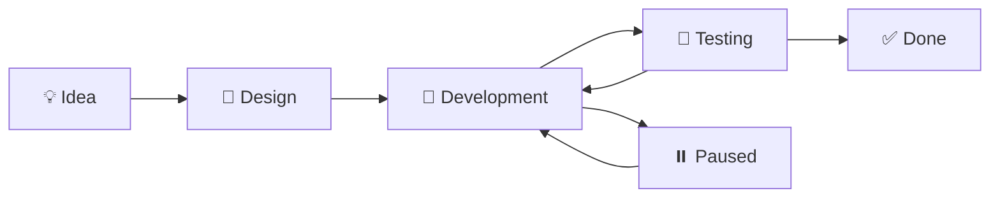

---
aliases:
  - Projects
  - Projects Index
tags:
  - MOC
date: 2026-04-15
---

# 🚀 Projects

> Map of Content — Index of all personal and professional projects.

**Related:** [[Home]], [[Development]]

---

## Active Projects

> [!note] No active projects yet. Move a project here once development begins.

---

## 💡 Ideas

### [[Master Config API]]
- **Idea:** Separate important settings from an app's main code into an independent service
- **Goal:** Store external service settings to enable zero-downtime upgrades
- **Stack:** [[FastAPI]] / [[NodeJS]], [[API Rest]], [[WebSocket]]
- **Status:** 🟡 Idea — pending stack comparison and auth implementation
- **Diagram:** [[Diagram.excalidraw|Architecture Diagram]]

### [[Personal ERP app]]
- **Idea:** Create an app for tracking everything in a person's life: tasks, projects, expenses — like [[Odoo]] for individuals
- **Status:** 🟡 Idea — needs goal definition and objectives
- **Related:** [[Odoo]]

### [[Room]]
- **Status:** 🟡 Diagram only
- **Diagram:** [[Diagram.excalidraw|Room Diagram]]

---

## 📋 Project Lifecycle

---

## Concepts to be documented

[[Microservices]], [[API Rest]], [[WebSocket]]

___
