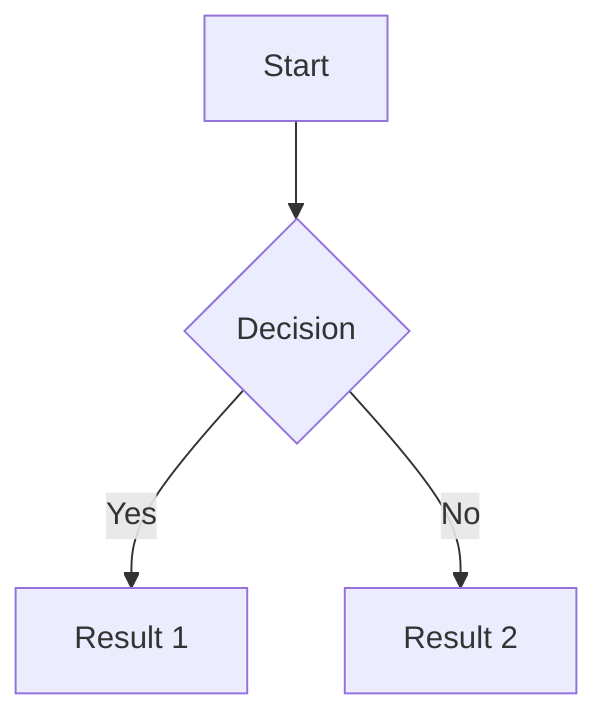
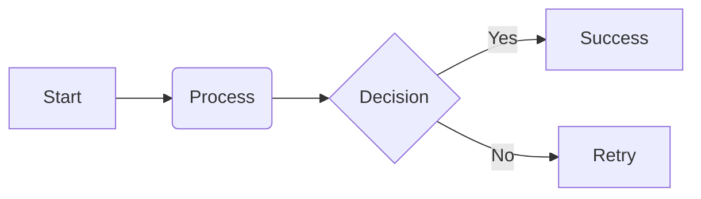

---
aliases:
  - Components
tags:
  - template/components
date: 2026-03-15
---
**Sources**: [Source]()

**Related:** [[Templates]]

---

## Characters Scaping

\# It shall not be interpreted as a Level 1 qualification
\## It shall not be interpreted as a Level 2 qualification

___

## Links

[Hugging Face](https://huggingface.co/)
<https://huggingface.co/>

---

## Tables

| **Header1** | **Header2** | **Header3** |
| ----------- | ----------- | ----------- |
| Text        | Text        | Text        |

| Left   |  Middle   |       Right |
| :----- | :-------: | ----------: |
| Info 1 |  Info 2   |      Info 3 |
| Text   | More text | Final words |

---

## Citations

> Write here...

> "Great phrase"
> Author

> First level
>> Second level
>>> Third level

---

## Code

```python
print("Hello world!")
```


```dockerfile title:Dockerfile
FROM python:3.11
...
```

---

## Alerts

> [!Note] Note

> [!tip] Tip

> [!info] Info

> [!success] Success

> [!warning] Warning

> [!error] Error

---

## Tasks

- [ ] 📅 2026-03-21 🔺 🏁 keep
- [x]  ✅ 2026-03-21

___

## Mermaid Diagrams






___

## HTML

<p style="text-align: center; color: red;">This text will be centered and red.</p>

___

## LaTeX

$$3^{4^5} + \frac{1}{2}$$ $$int_{0}^{\infty} e^{-x^2} \, dx = \frac{\sqrt{\pi}}{2}$$