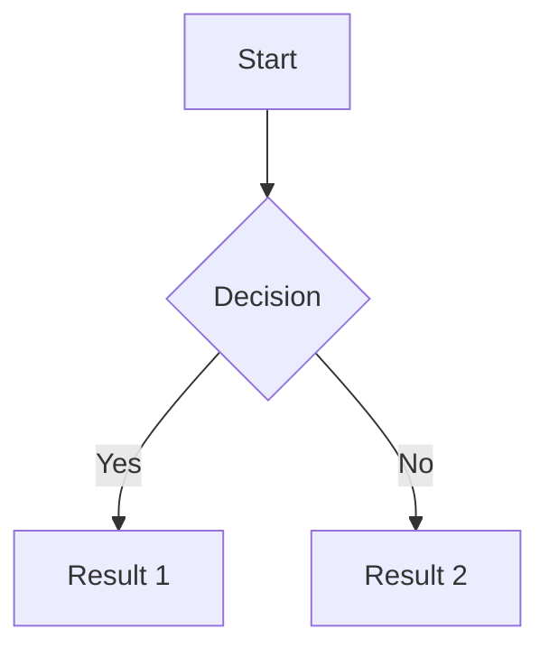
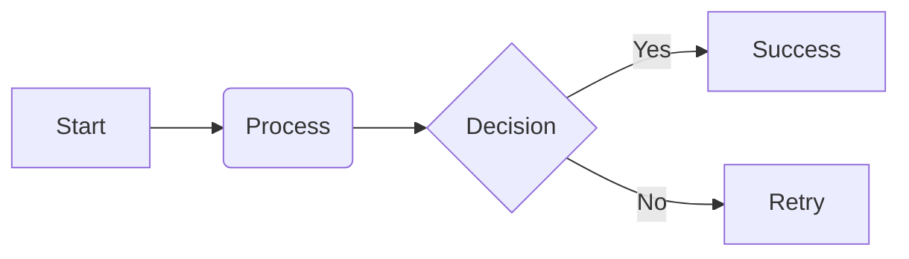

---
aliases:
  - Components
tags:
  - template
  - components
date: 2026-03-15
---
**Sources**: [Source]()

**Tags:** #components

**Related:** [[Templates]]

---

## Links

[Hugging Face](https://huggingface.co/)

---

## Tables

| **Header1** | **Header2** | **Header3** |
| ----------- | ----------- | ----------- |
| Text        | Text        | Text        |

---

## Citations

> Write here...

> "Great phrase"
> Author

---

## Code

```python
print("Hello world!")
```


```dockerfile title:Dockerfile
FROM python:3.11
...
```

---

## Alerts

> [!Note] Note

> [!tip] Tip

> [!info] Info

> [!success] Success

> [!warning] Warning

> [!error] Error

---

## Tasks

- [ ] 📅 2026-03-21 🔺 🏁 keep
- [x]  ✅ 2026-03-21

___

## Mermaid Diagrams






___