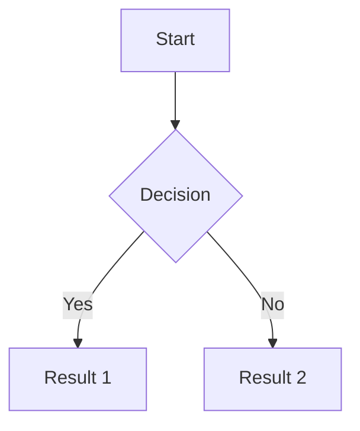
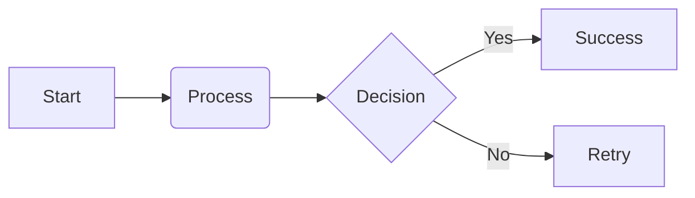
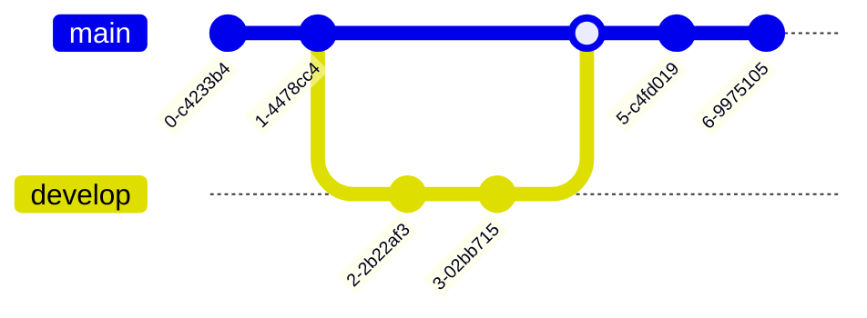

---
aliases:
  - Components
tags:
  - template/components
date: 2026-07-05
---
**Sources:** [Math symbols](https://es.piliapp.com/symbol/math/), [LaTex symbols](https://gitmind.com/es/faq/formula-list.html)

**Related:** [[Templates]]

---

## Characters Scaping

\# It shall not be interpreted as a Level 1 qualification
\## It shall not be interpreted as a Level 2 qualification

___

## Text Decorations

Highlighted ==text==

Removed ~~text~~

___

## Links

[Hugging Face](https://huggingface.co/)
<https://huggingface.co/>

---

## Tables

| **Header1** | **Header2** | **Header3** |
| ----------- | ----------- | ----------- |
| Text        | Text        | Text        |

| Left   |  Middle   |       Right |
| :----- | :-------: | ----------: |
| Info 1 |  Info 2   |      Info 3 |
| Text   | More text | Final words |

---

## Alerts

> [!NOTE]

> [!TIP]

> [!INFO]

> [!SUCCESS]

> [!WARNING]

> [!ERROR]

___

## Workdir trees

```
automatizaciones/
├── README.md
├── scraping/
│   ├── leads_linkedin/
│   │   ├── TASK.md
│   │   └──requirements.txt
│   └── ...
│
└── logs/
```

___

## Citations

> Write here...

> "Great phrase"
> Author

> First level
>> Second level
>>> Third level

---

## Code

```python
print("Hello world!")
```


```dockerfile title:Dockerfile
FROM python:3.11
...
```


### Diff

```diff
- if not 16.0 < float(server_serie) <= 17.0:
- raise UserError(f'Module support Odoo series 17.0 but found {server_serie}.')
...
+ if not 18.0 < float(server_serie) <= 19.0:
+ raise UserError(f'Module support Odoo series 19.0 but found {server_serie}.')
```

---

## Tasks

- [ ] 📅 2026-03-21 🔺 🏁 keep
- [x]  ✅ 2026-03-21

___

## [Mermaid Diagrams](https://mermaid.live/edit)


```mermaid
flowchart TD
A[Start] --> B{Decision}
B -- Yes --> C[Result 1]
B -- No --> D[Result 2]
```



```mermaid
flowchart LR
    A[Start] --> B(Process)
    B --> C{Decision}
    C -->|Yes| D[Success]
    C -->|No| E[Retry]
```


```mermaid
gitGraph
    commit
    commit
    branch develop
    checkout develop
    commit
    commit
    checkout main
    merge develop
    commit
    commit

```

___

## HTML

<p style="text-align: center; color: red;">This text will be centered and red.</p>

___

## LaTeX

$$3^{4^5} + \frac{1}{2}$$
$$x_{1}+x_{2}=0$$
$$int_{0}^{\infty} e^{-x^2} \, dx = \frac{\sqrt{\pi}}{2}$$
$$
|a| =
\begin{cases}
a, & \text{if } a \ge 0 \\
-a, & \text{if } a < 0
\end{cases}
$$