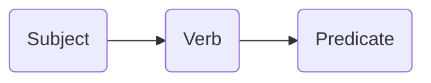

---
aliases:
  - Languages
tags:
  - lang
date: 2026-03-15
---
**Sources**: [Source]()

**Related:** [[Templates]]

---

## Structure

---

## Description

Write here...

---

## Usage

### First usage

Description...

> Example 1
> Example 2
> Example 3

___

## Related vocabulary

Write here...

---